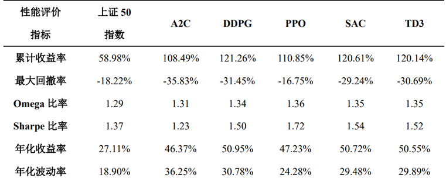

<<<<<<< HEAD
# QuantitativeTrading
QuantitativeTrading
=======
# 课程设计-强化学习量化交易策略

## 1.任务介绍：
* 股票交易是一个经典的时序决策问题，其指的是在每个交易时间点通过分析历史数据，从而做出对应决策（如：买入、卖出、观望等），以达到长期的最大收益。
* 因此，该问题可以被建模为一个强化学习问题。现在希望你能够使用强化学习算法，在给定的股票交易环境中训练并测试你的算法，要求算法性能在六个评价指标中能够超过给定的baseline模型。

## 2.环境介绍：
环境使用一个连续的动作空间来对上证50成分股的交易进行建模，状态包括个人持股，剩余资金等，动作包括买入、持有和卖出。详细的环境的介绍见代码Stock_Trading/README.md

## 3.代码介绍：
Stock_trading 目录下：README.md 介绍环境的设计； plot_traded_result.ipynb中用于在训练和测试结束后画图的代码。
Requirement.txt 中包含要运行该环境所需要的python包
Utils文件夹下是构建环境、模型和测试结果的代码。特别需要关注的是models.py文件中DRL_Agent类的构建和使用。其余文件如env.py, config.py 等不要进行修改。
Learn文件夹下 trainer.py实现了用来训练的类，trader.py实现了用来测试的类。可以运行start_train.sh 和start_test.sh进行训练和测试。 其中训练过程可以参考trainer.py自己编写并训练模型。可以像代码中一样使用stable_baseline3这个包来训练和测试，也可以自己实现代码。
测试必须用到trader.py中Trader这个类
你可以在Trader类中的trade方法调用自己的model来进行测试
Learn/data_file保存了构建环境所需要的数据。
Learn/train_file保存了已经训练好的五个baseline模型，可以调用他们进行比较和测试。
Learn/trade_file 保存了测试的结果， plot_traded_result.ipynb调用这些结果进行结果的可视化。

## 4.评价指标：

## 5.课设结果要求：
训练并测试你自己的深度强化学习智能体，要求最后的测试性能在所有的评价指标上，不能低于代码中给出的最差的baseline（最差不能低于上证50指数）。

## 6.关键时间节点和材料,参考
提交材料：课程设计报告+代码
截止时间：第15周周日（6月9日）
提交邮箱： 3042876006@qq.com
环境源码：StockRL：https://github.com/sunnyswag/StockRL
调优方法：百度+google+知乎+Bilibili。例如：https://zhuanlan.zhihu.com/p/482656367
https://zhuanlan.zhihu.com/p/345353294
错误告警：百度+google+助教
>>>>>>> 1f4b7b2 (add README)
